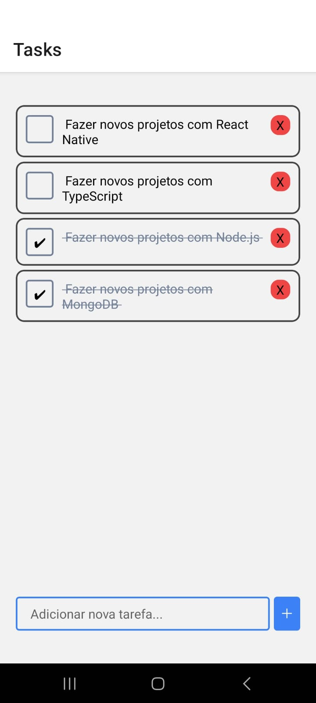

# To Do List

Este é um aplicativo de lista de tarefas simples desenvolvido em React Native utilizando o Expo. Ele permite que os usuários adicionem, visualizem, editem e excluam tarefas de forma prática e organizada.



## Funcionalidades

- Adicionar novas tarefas
- Listar tarefas existentes
- Editar tarefas ao pressionar
- Excluir tarefas concluídas

---

## Requisitos

Certifique-se de ter os seguintes softwares instalados em sua máquina:

- [Node.js](https://nodejs.org/) (versão recomendada: LTS)
- [Expo CLI](https://docs.expo.dev/get-started/installation/)
- Um simulador Android (Android Studio) ou o aplicativo Expo Go no seu celular

---

## Como rodar o projeto?

### Passo 1: Clonar o repositório

```bash
git clone https://github.com/bruno-ssilveira/reactnative_list.git
cd reactnative_list
```

### Passo 2: Instalar as dependências

Execute o comando abaixo para instalar as dependências do projeto:

```bash
npm install
```

### Passo 3: Iniciar o servidor Expo

Inicie o servidor do Expo com o seguinte comando:

```bash
expo start
```

---

## Testar o aplicativo

### 1. No celular (usando o Expo Go)

1. Instale o aplicativo **Expo Go** na [Google Play Store](https://play.google.com/store) ou na [App Store](https://apps.apple.com).
2. No terminal, após rodar o comando `expo start`, você verá um QR Code.
3. Abra o aplicativo Expo Go no celular e escaneie o QR Code.
4. O aplicativo será carregado no seu celular.

### 2. No simulador Android

1. Certifique-se de ter o Android Studio configurado e um dispositivo virtual (AVD) rodando.
2. No terminal, pressione a tecla **a** enquanto o servidor Expo estiver rodando.
3. O Expo abrirá automaticamente o aplicativo no simulador.

---

## Tecnologias utilizadas

- **React Native**
- **TypeScript**
- **Node.js**
- **Expo**

---

## Contribuindo

Sinta-se à vontade para contribuir com o projeto! Crie uma branch, faça suas alterações e abra um pull request. 

1. Crie uma branch: `git checkout -b minha-branch`
2. Faça suas alterações e comite: `git commit -m "Minha contribuição"`
3. Faça o push: `git push origin minha-branch`
4. Abra um pull request na página do repositório.

---

## Contato

Caso tenha dúvidas ou sugestões, entre em contato:

- **Email**: bruno.englishprog@gmail.com
- **LinkedIn**: https://www.linkedin.com/in/bruno-santos-silveira/
